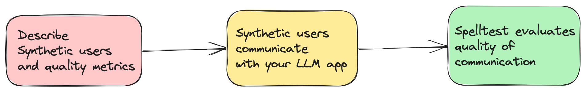

# Spelltest: Simulation Framework for LLM Based Applications

## QA for LLM

Today's AI-driven applications largely depend on Large Language Models (LLMs) like GPT-4 to deliver innovative solutions. However, ensuring that they provide relevant and accurate responses in every situation is a challenge. Spelltest addresses this by simulating LLM responses using synthetic user personas and an Evaluation AI to evaluate these responses.

### Project philosophy


 
Spelltest simulates and evaluates LLM responses using synthetic users providing a quality score from 0 to 100.  Think about it like a dress rehearsal before your app meets real users. Spelltest supports chat & completion modes.


### Why Spelltest?

- **Quality Assurance**: By simulating how users interact with your LLM-based application, Spelltest ensures your application provides high-quality responses before it interacts with real users.
  

- **Cost-effective & Efficient**: No need for manual, costly testing or semi-automated expensive methods.
  

- **Seamless Integration**: It easily fits into your current development process.


### Getting Started

1. **Installation**: Install the framework using pip.

   ```bash
   pip install spelltest
   ```

2. **Describe synthetic users, metrics and prompt for simulation**: Create a `.spelltest.yaml` file in your repository. Below is an example configuration for a travel scheduler AI app:

   ```yaml

    project_name: "Travel schedule app"
    
    # describe users
    users:
       nomad:    # an example if synthetic user case
         name: "Busy Nomad in Seattle"
         llm_name: gpt-3.5-turbo
         temperature: 0.7
         description: "You're a very busy nomad who struggles with planning. You're moved to Seattle and looking at how to spend your first Saturday exploring the city"
         expectation: "Well-planned objective, detailed, and comprehensive schedule that meets user's requirements"
         user_knowledge_about_app: "The app receives text input about travel requirements (i.e., place, preferences, short description of the family and their interests) and returns a travel schedule that accommodates all family members’ needs and interests."
         metrics: __all__
        
       family_weekend:
         name: "The Adventurous Family from Chicago"
         llm_name: gpt-3.5-turbo
         temperature: 0.7
         description: "You're a family of four (two adults and two children) based in Chicago looking to plan an exciting, yet relaxed weekend getaway outside the city. The objective is to explore a new environment that is kid-friendly and offers a mix of adventure and downtime."
         expectation: "A balanced travel schedule that combines fun activities suitable for children and relaxation opportunities for the entire family, considering travel times and kid-friendly amenities."
         user_knowledge_about_app: "The app receives text input about travel requirements (i.e., place, preferences, short description of the family and their interests) and returns a travel schedule that accommodates all family members’ needs and interests."
         metrics: __all__
        
       retired_couple:
         name: "Retired Couple Exploring Berlin"
         llm_name: gpt-3.5-turbo
         temperature: 0.7
         description: "You're a retired couple from the US, wanting to explore Berlin and soak in its rich history and culture over a 10-day vacation. You’re looking for a mixture of sightseeing, cultural experiences, and leisure activities, with a comfortable pace suitable for your age."
         expectation: "A comprehensive travel plan that provides a relaxed pace, ensuring enough time to explore and enjoy each location, and includes historical and cultural experiences. It should also consider comfort and accessibility."
         user_knowledge_about_app: "The app accepts text input detailing travel requirements (i.e., destination, preferences, duration, and a brief description of travelers) and returns a well-organized travel itinerary tailored to those specifics."
         metrics: __all__
    
    # describe quality metrics 
    metrics:  
      tpas:   # name of your metric
        description: "TPAS - The Travel Plan Accuracy Score. This metric measures the accuracy of the generated response by evaluating the inclusion of the expected output, well-scheduled travel plan and nothing else. The TPAS is a numerical value between 0 and 100, with 100 representing a perfect match to the expected output and 0 indicating non-accurate result."
    
    # describe prompts
    prompts:    
       smart-prompt: 
         file: ./smart-prompt    # expected that prompt located in this file
        
    # finally describe simulations
    simulations:
       test1:
         prompt: smart-prompt
         users: __all__
         llm_name: gpt-3.5-turbo
         temperature: 0.7
         size: 5
         chat_mode: true
         quality_threshold: 80


   ```
   
    Full configuration with prompt files is [here](https://github.com/artas728/spelltest/blob/first-release/tests/paid/yaml_configs/case_travel_app/.spellforge.yaml).


3. **Run the simulation**: 

   ```bash
   spelltest simulate
   ```

4. **Analysis**: Check the results of the simulation.

   ```bash
   spelltest analyze
   ```


⚠️ ⚠️ ⚠️  **Important Warnings**  ⚠️ ⚠️ ⚠️

- **OpenAI Costs**: Usage of this framework can lead to a significant number of requests to OpenAI, especially when running extensive simulations. This can result in substantial costs on your OpenAI account. Ensure you're mindful of your OpenAI budget and understand the pricing model. I bear no responsibility for any expenses incurred.

- **Early Release**: This version of Spelltest is in its early stages and has no stability guarantees. Kindly use it with caution and feel free to provide feedback or report issues.

⚠️ ⚠️ ⚠️ ⚠️ ⚠️ ⚠️ ⚠️ ⚠️ ⚠️ ⚠️ ⚠️ ⚠️ ⚠️ ⚠️ ⚠️ ⚠️ ⚠️ ⚠️ ⚠️ ⚠️ ⚠️ ⚠️ ⚠️ ⚠️ ⚠️ ⚠️ ⚠️ ⚠️ ⚠️ ⚠️ ⚠️ ⚠️ ⚠️ ⚠️ ⚠️ ⚠️ ⚠️ ⚠️ ⚠️ ⚠️ ⚠️ 


### Key Concepts

**Synthetic Users**

These are simulating real-user interactions with specific characteristics and expectations.

   - **User Background** (`description` field in `.spelltest.yaml`): A prompt that provides an overview of who this synthetic user is and the problems they want to solve using the app, e.g., a traveler managing their schedule.

   - **User Expectation** (`expectation` field): A prompt that defines what the synthetic user anticipates as a successful interaction or solution from using the app.

   - **Environment Awareness** (`user_knowledge_about_app` field): A prompt that ensures the synthetic user understands the application’s context, ensuring realistic testing scenarios.

**Metrics**

A prompt that represent standards or criteria used to evaluate and score the responses generated by the LLM in the simulations. Metrics can range from general measurements to more application-specific, custom metrics.

   **General Metric Examples**:
   
   - **Semantic Similarity**: Measures how closely the provided answer resembles an expected answer in terms of meaning.
   
   - **Toxicity**: Evaluates the response for any language or content that may be considered inappropriate or harmful.
   
   - **Structural Similarity**: Compares the structure and format of the generated response to a predefined standard or expected output.
   
   **More Custom Metric Examples**:
   
   - **TPAS (Travel Plan Accuracy Score)**: "This metric measures the accuracy of the generated response by evaluating the inclusion of the expected output and the quality of the proposed travel plan. TPAS is a numerical value between 0 and 100, with 100 representing a perfect match to the expected output and 0 indicating a non-accurate result."
   
   - **EES (Empathy Engagement Score)**: "The EES assesses the empathetic resonance of the LLM's responses. By evaluating understanding, validation, and supportive elements in the message, it scores the empathy level conveyed. EES ranges from 0 to 100, where 100 indicates a highly empathetic response, while 0 denotes a lack of empathetic engagement."


---

### Learn More

For more in-depth information, visit our [documentation](#).

### Example Templates

- For examples of user and metric definitions to help you get started, please check [User & Metric Examples](#).

---

**Make your LLM-based application better with Spelltest!**

