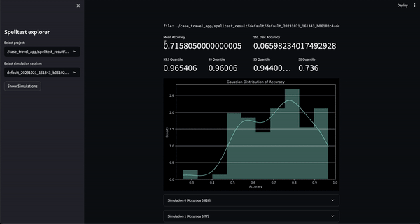

# Spelltest: AI-to-AI Testing for LLM Based Applications

[](https://pepy.tech/project/spelltest)

🌟 *If you find this project useful, please consider giving it a star! Your support motivates me to keep improving it!* 🌟


## AI-to-AI Testing for Quality Assurance

Today's AI-driven applications largely depend on Large Language Models (LLMs) like GPT-4 to deliver innovative solutions. However, ensuring that they provide relevant and accurate responses in every situation is a challenge. Spelltest addresses this by simulating LLM responses using synthetic user personas and an evaluation technique to evaluate these responses automatically(but still requires human supervision).

### How it works:

#### Step 1: Describe your simulation in `spellforge.yaml` file:

```yaml

    project_name: ...
    
    # describe users
    users:
       ...
    
    # describe quality metrics 
    metrics:  
      ...
    
    # describe prompts of your LLM app
    prompts:    
       ...
        
    # finally describe simulations
    simulations:
       ...


```


#### Step 2: Run simulations:


#### Step 3: Analyze results:



## Table of Contents
- [Spelltest: Simulation Framework for LLM Based Applications](#spelltest-simulation-framework-for-llm-based-applications)
  - [QA for LLM](#qa-for-llm)
- [Why Choose Spelltest?](#why-choose-spelltest)
- [Important Notices for Users](#important-notices-for-users)
  - [Project Maturity Warning](#project-maturity-warning)
  - [Cost Expectations](#cost-expectations)
- [Project Philosophy](#project-philosophy)
- [Getting Started](#getting-started)
  - [Installation](#installation)
  - [Configuration](#configuration)
    - [Synthetic Users](#synthetic-users)
    - [Quality Metrics](#quality-metrics)
    - [App's Prompts](#apps-prompts)
    - [Simulations](#simulations)
  - [Running Simulations](#running-simulations)
  - [Analysis](#analysis)
- [Integration Into Release Pipeline](#integration-into-release-pipeline)
- [Key Concepts](#key-concepts)
  - [Synthetic Users](#synthetic-users-1)
  - [Metrics](#metrics-1)

## Why Choose Spelltest?

- **Assured Quality**: Simulate user interactions for optimum responses.


- **Efficiency & Savings**: Save on manual testing costs.


- **Smooth Workflow Integration**: Fits seamlessly into your development process.

## Important Notices for Users

### Project Maturity Warning

Please be aware that this is a very early version of Spelltest. As such, it has not yet been extensively tested in diverse environments and use-cases. By deciding to use this version, you accept that you are using the Spelltest framework at your own risk. We highly encourage users to report any issues or bugs they encounter to assist in the improvement of the project.

### Cost Expectations

Regarding the operational costs, it's important to note that running simulations with Spelltest incurs charges based on the usage of the OpenAI API. There is no cost estimations or budget limit at the moment.  For context, running a batch of 100 simulations may cost approximately $0.7 to $1.8 (gpt-3.5-turbo), depending on several factors including the specific LLM and the complexity of the simulations.

Given these costs, we highly recommend starting with a smaller number of simulations to both keep your initial costs down and help you estimate future expenses better. As you become more familiar with the framework and its cost implications, you can adjust the number of simulations according to your budget and needs.

Remember, the goal of Spelltest is to ensure high-quality responses from LLMs while remaining as cost-effective as possible in your AI development and testing process.


## Project philosophy


 
Spelltest takes a distinctive approach to quality assurance. By using synthetic user personas, we not only simulate interactions but also capture unique user expectations, providing a context-rich environment for testing. This depth of context allows us to evaluate the quality of LLM responses in a manner that closely mirrors real-world applications.

The result? A quality score ranging from 0.0 to 1.0, acting as a comprehensive dress rehearsal before your app meets its real users. Whether in chat or completion mode, Spelltest ensures that the LLM responses align closely with user expectations, enhancing overall user satisfaction.


## Getting Started

### Installation 

Install the framework using pip:

   ```bash
   pip install spelltest
   ```
### Configuration

The `.spellforge.yaml` is central to Spelltest, containing synthetic user profiles, metrics, prompts, and simulations. Below is a breakdown of its structure:

#### Synthetic Users
Synthetic users mimic real-world users, each with a unique background, expectation, and understanding of the app. The configuration for synthetic users includes:
- **Sub Prompts**: These are descriptive elements providing context to the user profile. They include:
  - `description`: A brief about the synthetic user.
  - `expectation`: What the user expects from the interaction.
  - `user_knowledge_about_app`: Level of familiarity with the app.

   Each synthetic user also has a:
  - `name`: The identifier for the synthetic user.
  - `llm_name`: The LLM models to use(tested on OpenAI models only).
  - `temperature`: ...


Example of synthetic user config:
```yaml
...
    nomad:
      name: "Busy Nomad in Seattle"
      llm_name: gpt-3.5-turbo
      temperature: 0.7
      description: "You're a very busy nomad who struggles with planning. You're moved to Seattle and looking at how to spend your first Saturday exploring the city"
      expectation: "Well-planned objective, detailed, and comprehensive schedule that meets user's requirements"
      user_knowledge_about_app: "The app receives text input about travel requirements (i.e., place, preferences, short description of the family and their interests) and returns a travel schedule that accommodates all family members’ needs and interests."
      metrics: __all__
...
```

#### Quality Metrics
Metrics are used to evaluate and score the LLM's responses. Each metric contains a sub prompt `description` which provides context on what the metric assesses.

Example of simple metric config:
```yaml
...
    metrics:  
      accuracy:
        description: "Accuracy"
    
...
```

Example of complex/custom metric config:
```yaml
...
    metrics:  
      tpas:
        description: "TPAS - The Travel Plan Accuracy Score. This metric measures the accuracy of the generated response by evaluating the inclusion of the expected output, well-scheduled travel plan and nothing else. The TPAS is a numerical value between 0 and 100, with 100 representing a perfect match to the expected output and 0 indicating non-accurate result."
    
...
```

#### App's Prompts
Prompts are questions or tasks that the app poses. These are used in simulations to test the LLM's ability to generate suitable responses. Each prompt is defined with a `description` and the actual `prompt` text or task.

```yaml
...
prompts:
  book_flight:
    file: book-flight-prompt.txt
...
```
#### Simulations
Simulations specify the testing scenario. Key elements include `prompt`, `users`, `llm_name`, `temperature`, `size`, `chat_mode`, and `quality_threshold`.


```yaml

    project_name: "Travel schedule app"
    
    # describe users
    users:
       nomad:
         name: "Busy Nomad in Seattle"
         llm_name: gpt-3.5-turbo
         temperature: 0.7
         description: "You're a very busy nomad who struggles with planning. You're moved to Seattle and looking at how to spend your first Saturday exploring the city"
         expectation: "Well-planned objective, detailed, and comprehensive schedule that meets user's requirements"
         user_knowledge_about_app: "The app receives text input about travel requirements (i.e., place, preferences, short description of the family and their interests) and returns a travel schedule that accommodates all family members’ needs and interests."
         metrics: __all__
        
       family_weekend:
         name: "The Adventurous Family from Chicago"
         llm_name: gpt-3.5-turbo
         temperature: 0.7
         description: "You're a family of four (two adults and two children) based in Chicago looking to plan an exciting, yet relaxed weekend getaway outside the city. The objective is to explore a new environment that is kid-friendly and offers a mix of adventure and downtime."
         expectation: "A balanced travel schedule that combines fun activities suitable for children and relaxation opportunities for the entire family, considering travel times and kid-friendly amenities."
         user_knowledge_about_app: "The app receives text input about travel requirements (i.e., place, preferences, short description of the family and their interests) and returns a travel schedule that accommodates all family members’ needs and interests."
         metrics: __all__
        
       retired_couple:
         name: "Retired Couple Exploring Berlin"
         llm_name: gpt-3.5-turbo
         temperature: 0.7
         description: "You're a retired couple from the US, wanting to explore Berlin and soak in its rich history and culture over a 10-day vacation. You’re looking for a mixture of sightseeing, cultural experiences, and leisure activities, with a comfortable pace suitable for your age."
         expectation: "A comprehensive travel plan that provides a relaxed pace, ensuring enough time to explore and enjoy each location, and includes historical and cultural experiences. It should also consider comfort and accessibility."
         user_knowledge_about_app: "The app accepts text input detailing travel requirements (i.e., destination, preferences, duration, and a brief description of travelers) and returns a well-organized travel itinerary tailored to those specifics."
         metrics: __all__
    
    # describe quality metrics 
    metrics:  
      tpas:   # name of your metric
        description: "TPAS - The Travel Plan Accuracy Score. This metric measures the accuracy of the generated response by evaluating the inclusion of the expected output, well-scheduled travel plan and nothing else. The TPAS is a numerical value between 0 and 100, with 100 representing a perfect match to the expected output and 0 indicating non-accurate result."
    
    # describe prompts
    prompts:    
       smart-prompt: 
         file: ./smart-prompt    # expected that prompt located in this file
        
    # finally describe simulations
    simulations:
       test1:
         prompt: smart-prompt
         users: __all__
         llm_name: gpt-3.5-turbo
         temperature: 0.7
         size: 5
         chat_mode: true    # completion mode if `false`
         quality_threshold: 80


```
   
Full configuration with prompt files is [here](https://github.com/artas728/spelltest/blob/first-release/tests/paid/yaml_configs/case_travel_app/.spellforge.yaml).


### Running Simulations


⚠️ ⚠️ ⚠️  **Important Warnings**  ⚠️ ⚠️ ⚠️

- **OpenAI Costs**: Usage of this framework can lead to a significant number of requests to OpenAI, especially when running extensive simulations. This can result in substantial costs on your OpenAI account. Ensure you're mindful of your OpenAI budget and understand the pricing model. I bear no responsibility for any expenses incurred.

- **Early Release**: This version of Spelltest is in its early stages and has no stability guarantees. Kindly use it with caution and feel free to provide feedback or report issues.

⚠️ ⚠️ ⚠️ ⚠️ ⚠️ ⚠️ ⚠️ ⚠️ ⚠️ ⚠️ ⚠️ ⚠️ ⚠️ ⚠️ ⚠️ ⚠️ ⚠️ ⚠️ ⚠️ ⚠️ ⚠️ ⚠️ ⚠️ ⚠️ ⚠️ ⚠️ ⚠️ ⚠️ ⚠️ ⚠️ ⚠️ ⚠️ ⚠️ ⚠️ ⚠️ ⚠️ ⚠️ ⚠️ ⚠️ ⚠️ ⚠️ 


   ```bash
   export OPENAI_API_KEYS=<your api keys>
   spelltest --config_file .spellforge.yaml
   ```


#### Analysis
Check the results of the simulation.

   ```bash
   spelltest --analyze
   ```


### Integration Into Release Pipeline

Integrating Spelltest into your release pipeline enhances your deployment strategy by incorporating consistent, automated testing. This crucial step ensures that your LLM-based applications maintain a high standard of quality by systematically simulating and evaluating user interactions before any release. This practice can save significant time, reduce manual error, and provide key insights into how changes or new features will affect user experience.

### Continuous Integration (CI) with Spelltest and OpenAI API

This guide will walk you through the process of setting up and automating continuous integration for your projects.

#### Prerequisites

Before you get started, make sure you have the following prerequisites in place:

1. A GitHub repository containing your project.

2. Access to SpellForge with an API key. If you don't have one, you can obtain it from the SpellForge website.

3. An OpenAI API key for using OpenAI services. If you don't have one, you can obtain it from the OpenAI website.

#### Step 1: Create and Configure `.spellforge.yaml`

Create a `.spellforge.yaml` file in the root directory of your project. This file will contain the instructions for Spelltest.


#### Step 2: Create .github/workflows/.spelltest.yaml

  Create a GitHub Actions workflow file, e.g., .github/workflows/.spelltest.yaml, to automate SpellForge testing. Insert the following code into this file:

   ```yaml
   # .spelltest.yaml
   name: Spelltest CI

   on:
     push:
       branches: [ "main" ]

   env:
     SPELLTEST_CONFIG_PATH: ${{ env.SPELLTEST_CONFIG_PATH }}
     OPENAI_API_KEY: ${{ secrets.OPENAI_API_KEY }}

   jobs:
     test:
       runs-on: ubuntu-latest
       steps:
         - uses: actions/checkout@v3
         - name: Install SpellTest library
           run: pip install spelltest
         - name: Run tests
           run: spelltest --config_file $SPELLTEST_CONFIG_PATH
   ```
This workflow is triggered on every push to the main branch and will run your SpellForge tests.

#### Step 3: GitHub Repository Settings

1. Go to your GitHub repository and navigate to the "Settings" tab.

2. Under "Secrets" add two new secrets:

   ```OPENAI_API_KEY```: Set this secret to your OpenAI API key.

3. Add a GitHub environment variable:

   ```SPELLTEST_CONFIG_PATH```: Set this variable to the full path to your .spellforge.yaml file within your repository.


### Key Concepts

#### Synthetic Users

These are simulating real-user interactions with specific characteristics and expectations.

   - **User Background** (`description` field in `.spellforge.yaml`): A sub prompt that provides an overview of who this synthetic user is and the problems they want to solve using the app, e.g., a traveler managing their schedule.

   - **User Expectation** (`expectation` field): A sub prompt that defines what the synthetic user anticipates as a successful interaction or solution from using the app.

   - **Environment Awareness** (`user_knowledge_about_app` field): A sub prompt that ensures the synthetic user understands the application’s context, ensuring realistic testing scenarios.

#### Metrics

A sub prompt that represent standards or criteria used to evaluate and score the responses generated by the LLM in the simulations. Metrics can range from general measurements to more application-specific, custom metrics.

   General Metric Examples:
   
   - **Semantic Similarity**: Measures how closely the provided answer resembles an expected answer in terms of meaning.
   
   - **Toxicity**: Evaluates the response for any language or content that may be considered inappropriate or harmful.
   
   - **Structural Similarity**: Compares the structure and format of the generated response to a predefined standard or expected output.
   
   More Custom Metric Examples:
   
   - **TPAS (Travel Plan Accuracy Score)**: "This metric measures the accuracy of the generated response by evaluating the inclusion of the expected output and the quality of the proposed travel plan. TPAS is a numerical value between 0 and 100, with 100 representing a perfect match to the expected output and 0 indicating a non-accurate result."
   
   - **EES (Empathy Engagement Score)**: "The EES assesses the empathetic resonance of the LLM's responses. By evaluating understanding, validation, and supportive elements in the message, it scores the empathy level conveyed. EES ranges from 0 to 100, where 100 indicates a highly empathetic response, while 0 denotes a lack of empathetic engagement."


---


**Make your LLM-based application better with Spelltest!**
